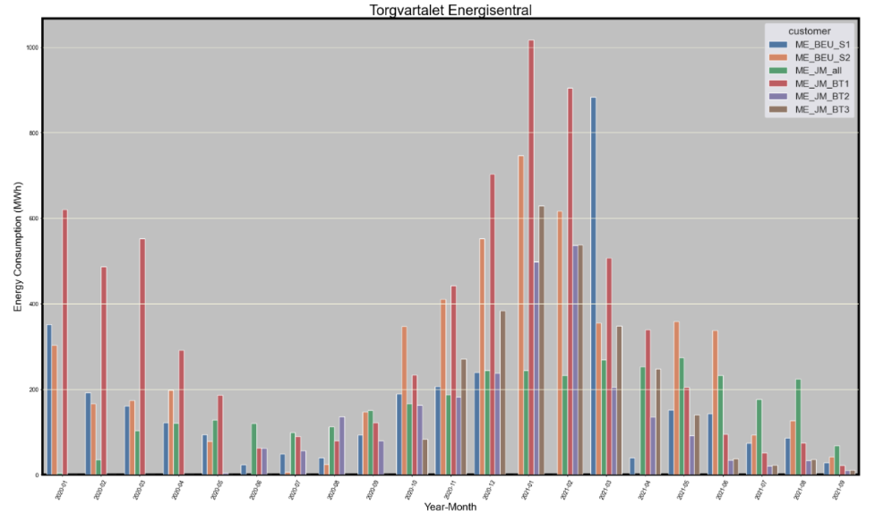

### **Processing and displaying energy center given information**

##### My first Django project :).

During the internship, I was faced with the task of processing and displaying data from the company database on a graph.
And creating a form to update this chart.
Also was created several HTML pages, where Other pages are simply informational. Description or display of different
tables according to pre-planned queries.

Key features:

* custom user registration model
* regular Django admin panel

To accomplish this task, I used the Python libraries:

* matplotlib
* seaborn
* pandas
* numpy

# processing-and-displaying-energy-center-information
# energy_center_information
